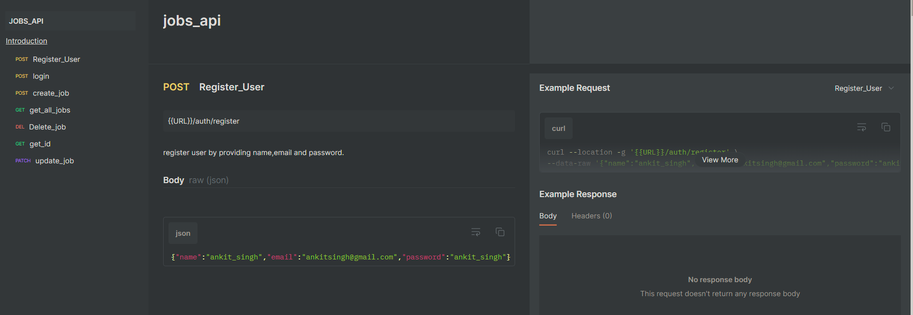
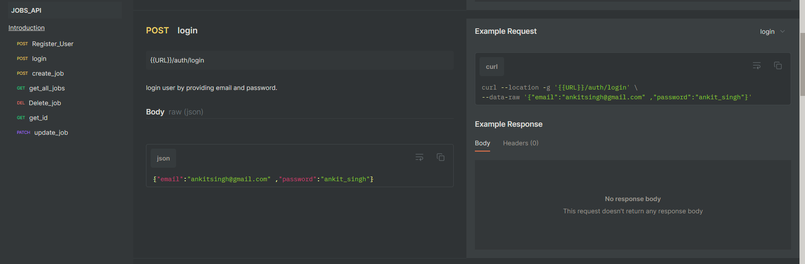
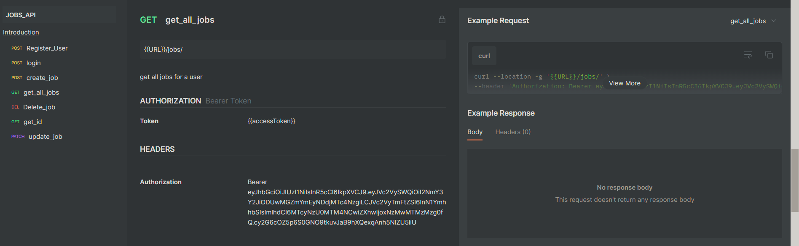
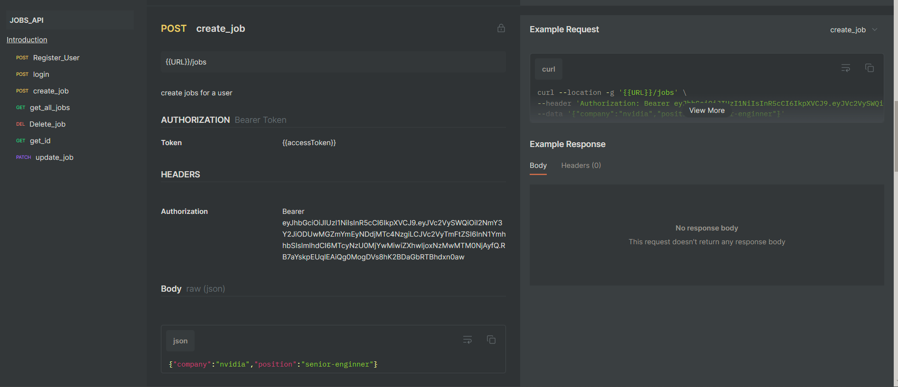
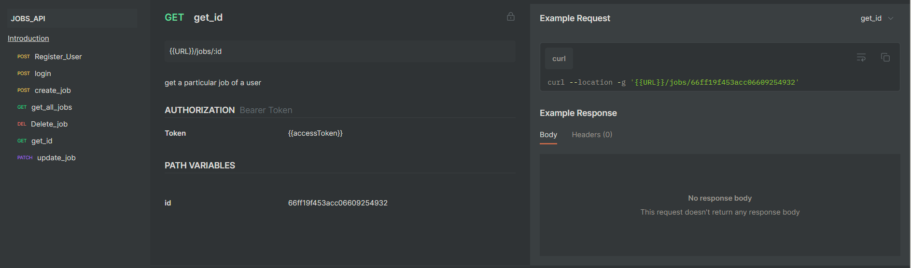
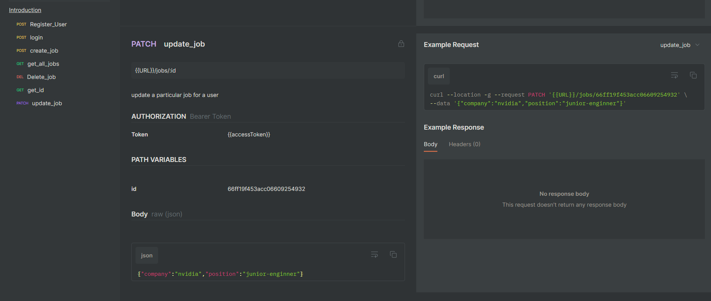
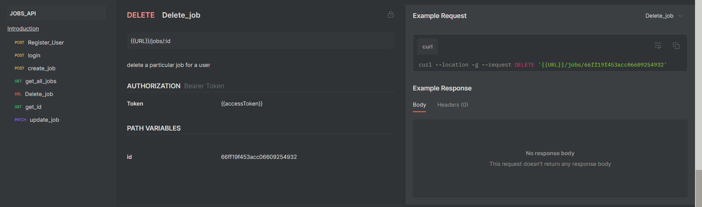

## Screenshots

Backend Project

Register Route

Login Route

GetAllJobs Route

CreateJob Route

GetJobById Route

UpdateJobById Route

DeleteJobById Route

Deployment Link https://job-api-2-40ra.onrender.com

